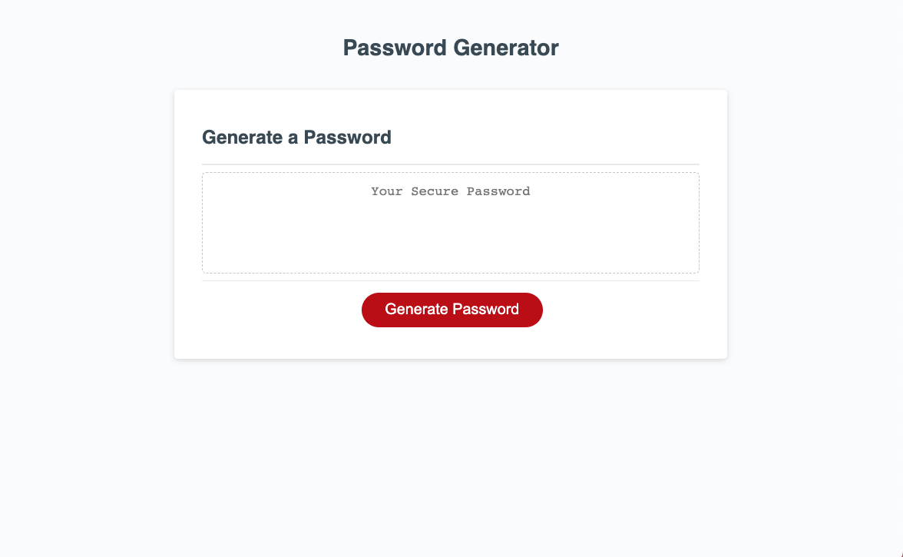
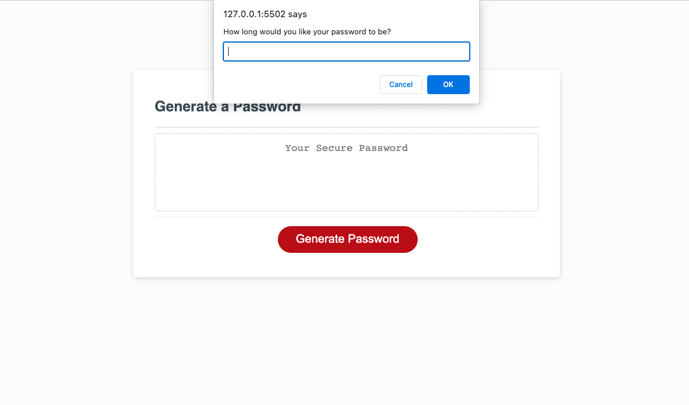
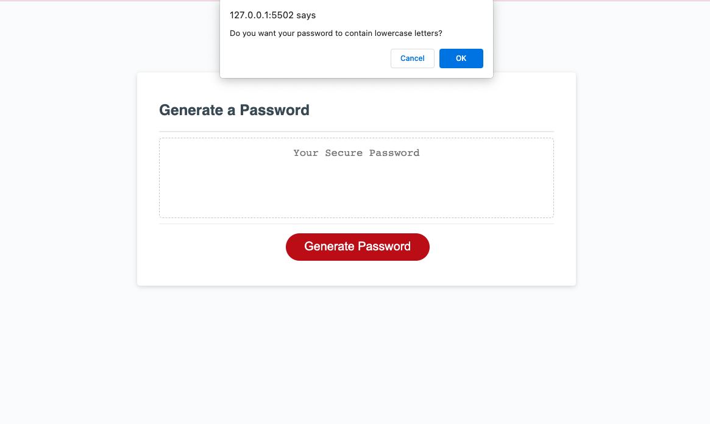
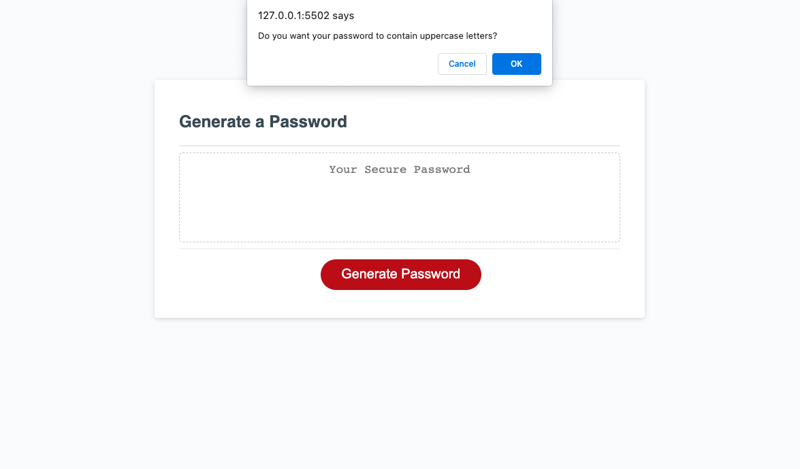
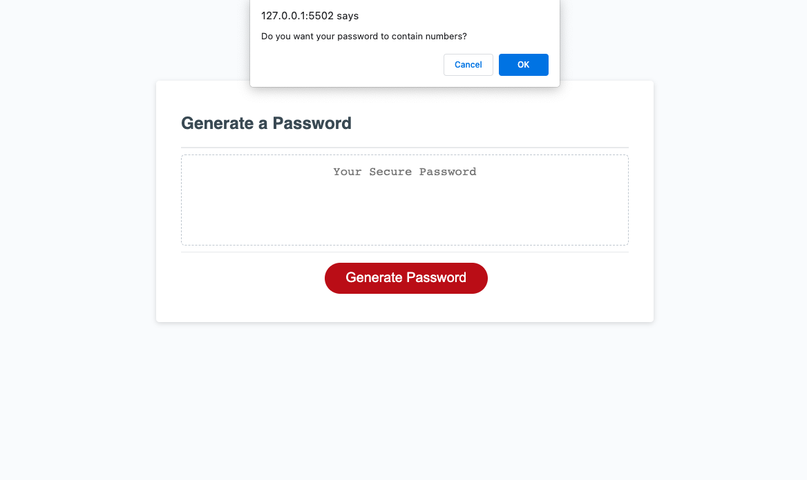
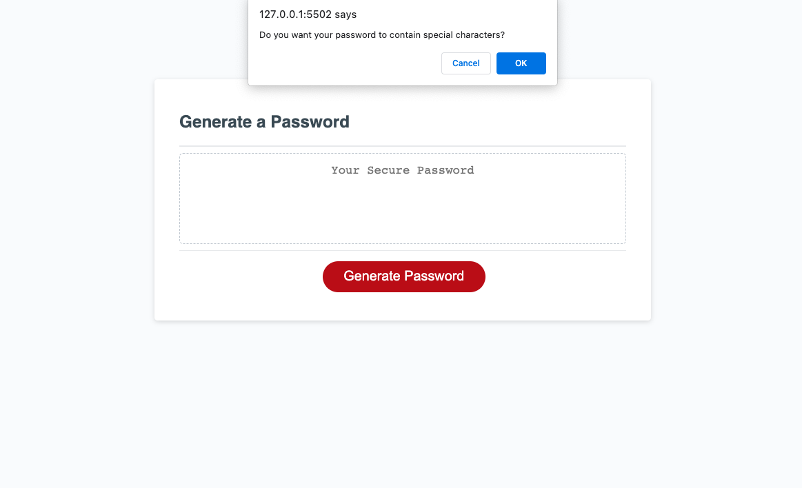

# PasswordLock
JavaScript Challenge: Password Generator

## Description
For all employees with access to sensitive data, I have created a password generator that meets certain criteria(s). In this case, all employees will be able to create highly strong passwords that provides greater security for all. All employees will be able to choose what they would like in their password or not and it will generate a unique password for each individual. 

## Instructions
- GIVEN I need a new, secure password
- WHEN I click the button to generate a password
- THEN I am presented with a series of prompts for password criteria
- WHEN prompted for password criteria
- THEN I select which criteria to include in the password
- WHEN prompted for the length of the password
- THEN I choose a length of at least 8 characters and no more than 128 characters
- WHEN asked for character types to include in the password
- THEN I confirm whether or not to include lowercase, uppercase, numeric, and/or special characters
- WHEN I answer each prompt
- THEN my input should be validated and at least one character type should be selected
- WHEN all prompts are answered
- THEN a password is generated that matches the selected criteria
- WHEN the password is generated
- THEN the password is either displayed in an alert or written to the page

## Mock Up

## Deployment

## GitHub
https://github.com/yaneyalvarado/PasswordLock
